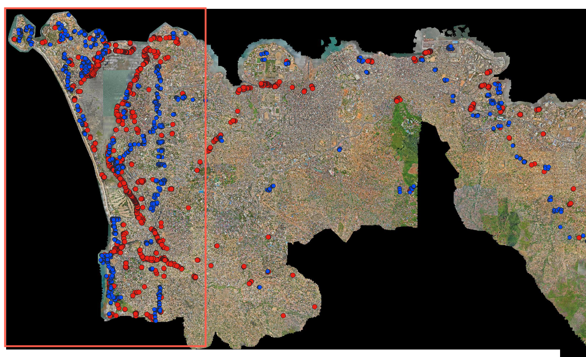

# Processing Steps for Waste Detection 

## Image Preparation

- Downloaded the source imagery from OpenAerialMap (see link below).
[Freetown](https://map.openaerialmap.org/#/-13.276258707046509,8.482166805713502,16/square/033321123222113100/69075f1de47603686de24fe8?_k=fznjse)

- Labeled waste and non-waste points in QGIS.  
  - Approximately 2,000 points for each class.

Waste Points
<figure>
  <p align="center">
    
  </p>
</figure>

The area covered by orenge line is used for analysis.

Red: Waste Points, Blue: Non-Waste Points
  <figure>
    <p align="center">
    
    </p>
  </figure>
  
<!--  -->

<!--  -->
## Small Image Generation

- Generated small image patches of size **5m×5m**.  
- Total number of tiles: approximately **470,000**.  
- Assigned image tiles to train, validation, and test sets with a 70/15/15 split.

---

## YOLO v11 Training and Prediction

### Dataset Overview

- **Waste images:** Approximately **2000**  
- **Non-waste images:** Approximately **2000**

### Classification Process

- **Training and Evaluation:**  
  Using Google Colab to train and evaluate the model on the train and validation datasets.

- **Testing:**  
  After training, the model is tested on images from the test dataset.

- **TIF to PNG Conversion:**  
  TIF images caused errors, so they were converted to PNG format and stored in the `"WorkinProgress/test_images/"` folder.  
  (GitHub: [convert_tif_to_png](https://github.com/your-repo-link))

- **Accuracy Evaluation:**  
  The model's accuracy is determined by comparing its predictions with manually annotated waste images.

### YOLOv11 Model

- **Model:** YOLOv11 for waste detection training and prediction.
- **Code for training and prediction:** [Google Drive Link](https://drive.google.com/drive/folders/1fmq_6M71yEN_Fhsz8qPjqdWWGq9-DT5g?usp=drive_link)  
  The code is stored in the `Code/GeoAI` folder.


# Folder Structure

## Google Drive Structure

```
GeoAI/
├── Data/
│   ├── OriginalDataset/
│   │   ├── images/
│   │   │   ├── train/        # 70% images for training
│   │   │   │   ├── waste/
│   │   │   │   └── non_waste/
│   │   │   ├── val/          # 15% images for validation
│   │   │   │   ├── waste/
│   │   │   │   └── non_waste/
│   │   │   └── test/         # 15% images for testing
│   │   │       ├── waste/
│   │   │       └── non_waste/
│   │   ├── points/           # GeoJSON files with waste and non-waste points
│   │   ├── tifdata/          # TIF files
│   │   └── grid/             # Grid information
│   └── WorkinProgress/
│       └── test_images/      # PNG images for testing, same as OriginalDataset/images/test
├── Code/
   └── YOLOv11/              # Scripts for training and evaluation
```


## Local Repository Structure

The code in git repository mainly includes functions for saving images and converting TIF files to PNG. The analysis is performed on Google Colaboratory by mounting Google Drive.

```
GeoAI/
├── 01_data/                      
│   ├── raw/                       
│   │   ├── tiles/        # raw tiles
│   │   ├── images/        
│   │   │   ├── train/        # 70% tiles for training
│   │   │   │   ├── waste/        
│   │   │   │   └── non-waste/        
│   │   │   ├── val/          # 15% tiles for validation
│   │   │   │   ├── waste/        
│   │   │   │   └── non-waste/        
│   │   │   └── test/         # 15% tiles for testing
│   │   │       ├── waste/        
│   │   │       └── non-waste/        
│   │   ├── points/         # GeoPackage files with grid information
│   │   └── precipitation/         # GeoPackage files with grid information
│   └── intermediate/                
│       └── test_images/        
├── 02.clean/                  
│   └── assign_files.py           # Function to assign image tiles to train, val, test sets
│   └── convert_tif_to_png.py     # Function to convert TIF files to PNG format
└── README.md                   
```
